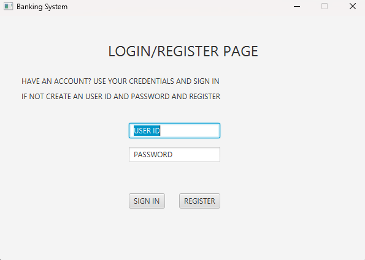
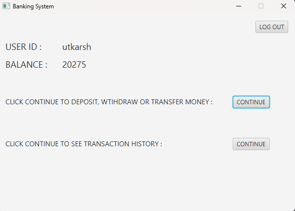
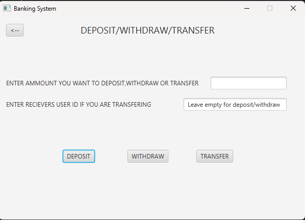
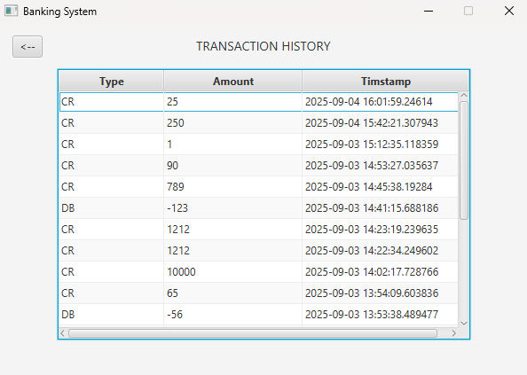

A simple banking application built with JavaFX for the UI, demonstrating core banking operations such as creating accounts, handling deposits & withdrawals, and basic transaction management.

🔹 This project serves as a learning / demo project for understanding UI using JavaFX and object-oriented design concepts in a real-world banking scenario.

📋 Features

✔ Secure data storage using Supabase

✔ Clean JavaFX UI with event-driven design

✔ Create and manage customer bank accounts

✔ Deposit and withdraw funds

✔ View account balances

✔ Basic transaction handling

Tech Stack

JavaFX – Frontend UI

Java 17+ – Core language

Maven – Build system

Supabase – Database & backend

